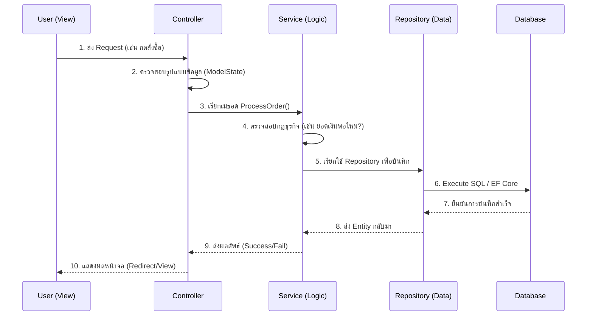

เพื่อให้คุณเข้าใจการเขียนโปรแกรม .NET แบบแบ่งเลเยอร์ (Layered Architecture) อย่างถ่องแท้ ผมได้จัดทำเนื้อหาแบบ **"เจาะลึก"** ทุกประเด็นที่โปรแกรมเมอร์มืออาชีพต้องรู้ ตั้งแต่หลักการออกแบบ ไปจนถึงการเขียน Unit Test และข้อควรระวังครับ

ผมได้สร้างไฟล์ **`.md`** ที่รวมเนื้อหาทั้งหมดนี้ไว้ให้คุณดาวน์โหลดไปอ่านหรือเก็บเป็น Reference ในโปรเจกต์ได้เลยครับ

### 📥 ดาวน์โหลดไฟล์เนื้อหาฉบับเจาะลึก (.md)
[file-tag: NET_Deep_Dive_Architecture_and_UnitTesting.md]

---

### 📘 สรุปเนื้อหาสำคัญที่อยู่ในไฟล์ (Executive Summary)

#### **1. ความลับของ Dependency Injection (DI) และ Interface**
ในโครงสร้างนี้ เราจะไม่ประกาศ `new ProductService()` ใน Controller ตรงๆ แต่เราจะขอผ่าน **Constructor** การทำแบบนี้เรียกว่า **Inversion of Control (IoC)**
* **ประโยชน์:** ทำให้เราสามารถ "สลับ" ไส้ในของ Repository ได้โดยไม่ต้องแก้โค้ดที่ Service แม้แต่บรรทัดเดียว (สำคัญมากในการทำ Unit Test)

#### **2. เจาะลึกเลเยอร์ Service (The Brain of App)**
เลเยอร์นี้ห้ามติดต่อ Database โดยตรง และห้ามรับค่า `HttpRequest` มาประมวลผล
* **สิ่งที่ต้องทำ:** รับข้อมูลที่เป็น Object หรือ Primitive type (int, string) มาตรวจสอบ Logic
* **ตัวอย่าง:** การเช็คสต็อก, การคำนวณส่วนลดตามระดับสมาชิก, การส่ง Email ยืนยัน

#### **3. การเขียน Unit Test ด้วย Mocking (AAA Pattern)**
หัวใจของการ Test คือการ **"ตัดขาดการพึ่งพา"**
* เราใช้ **Moq** เพื่อสร้าง Repository ปลอม เพื่อทดสอบว่าถ้า Repo คืนค่าว่างมา Service ของเราจะ Crash หรือไม่
* **Arrange:** ตั้งค่าสถานการณ์สมมติ
* **Act:** รันฟังก์ชันที่ต้องการทดสอบ
* **Assert:** ตรวจสอบผลลัพธ์ด้วยความแม่นยำ

#### **4. กฎเหล็ก 5 ข้อ (The Golden Rules)**
1.  **Circular Dependency:** ห้ามเลเยอร์ล่างเรียกเลเยอร์บนเด็ดขาด
2.  **DTO vs Entity:** อย่าส่ง Entity (ที่ผูกกับ DB) ไปถึงหน้าจอ ให้แปลงเป็น DTO ก่อนเสมอเพื่อความปลอดภัย
3.  **Thin Controller:** Controller ต้องมีโค้ดน้อยที่สุด (ไม่เกิน 5-10 บรรทัดต่อ Method)
4.  **Single Responsibility:** หนึ่ง Class ทำหน้าที่อย่างเดียว (เช่น UserRepository ทำแค่เรื่อง User)
5.  **Global Exception Handling:** จัดการ Error ที่จุดเดียว (Middleware) ไม่ต้อง `try-catch` ซ้อนกันทุกไฟล์

---

### 🔄 แผนผังโฟลว์การทำงานแบบละเอียด (Deep Dive Flow)

**คำแนะนำ:** หากคุณกำลังเริ่มโปรเจกต์ใหม่ แนะนำให้สร้างโปรเจกต์แบบ **Web API** แล้วลองแยกเลเยอร์ตามนี้ดูครับ จะเห็นผลชัดเจนมากเมื่อคุณเริ่มเขียน Unit Test ครับ

**มีส่วนไหนที่คุณต้องการให้ผมขยายความเพิ่มเติม หรืออยากได้ตัวอย่างโค้ดในเลเยอร์ไหนเป็นพิเศษไหมครับ?**
